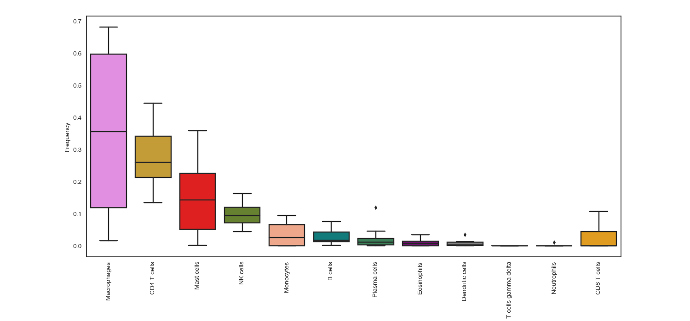
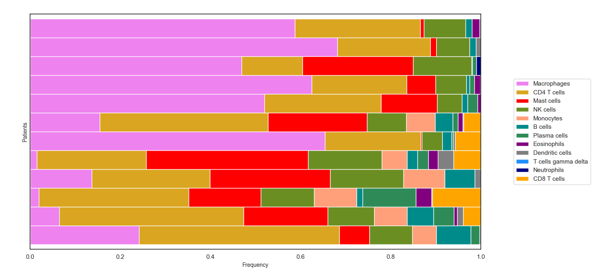
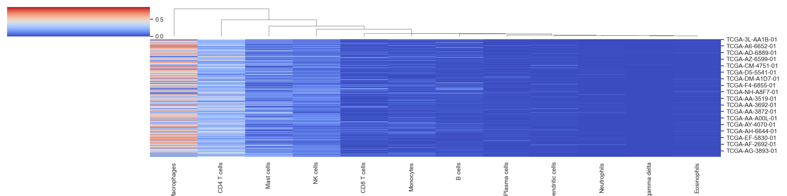

.. highlight:: rst

Post-processing & Visualization
++++++++++++++++++++++++++++++++

TumorDecon provides functions for creating the following plots, for digital cytometry performed with the LM22 signature matrix (or up-regulated genes for the 22 cell types in LM22):

- Box plots that show immune cells frequencies in descending order, so that users can easily recognize the most frequent immune cells within a group of samples/patients
- Bar charts that show the estimated percentage of each immune cell within a group of individual samples
- Pair plots that illustrate the correlation between different immune cells
- Cluster heat maps that group cells based on their euclidean distance

**WARNING:** The following 4 functions for plotting data currently only work for results generated with LM22 cell signatures, as the names of the cell types are hard-coded into the color plots. If you are working with a different group of cell types, you will need to define your own dictionary for combing cell types, with the ``combine_celltypes()`` function, and then drop any column names with non-LM22 cell types. An example of this is provided further down this page.

.. function:: cell_frequency_boxplot (sample_cell_freq, title="", title_fontsize=10, save_as=None, axes_style=None, font_scale=1, xylabel_fontsize=10, rcParams={'figure.figsize':(15,7)})

  Create boxplot of the output from the ``tumor_deconvolve()`` function for digital cytometry. Boxplot shows distribution of frequencies across all samples (patients), for each cell type.

  :param sample_cell_freq: Pandas DataFrame. Output file from the ``tumor_deconvolve()`` function for digital cytometry. Rows are patient IDs, columns are cell typs
  :param title: String. Plot title
  :param title_fontsize: Int. Font-size for title.
  :param save_as: String. Filename to save plot to. File format is inferred from filename's extension ('.png', '.pdf', '.eps', etc). If None, plot is not saved.
  :param axes_style: Dictionary. Parameters to pass to ``sns.set_style``, to customize plot. Valid dictionary keys can be found by running "sns.axes_style()" with no arguments
  :param font_scale: Float. Scaling for plot elements such as tick labels
  :param xylabel_fontsize: Int. Font-size for axis labels.
  :param rcParams: Dictionary of parameters to pass as the rc argument to ``sns.set`` function. Valid dictionary keys can be found at https://matplotlib.org/stable/tutorials/introductory/customizing.html

  :return: Matplotlib boxplot

**Example 1: Boxplot.** The data plotted in this example is all patients from the result of running Cibersort on the Colorectal Adenocarcinoma RNA Seq v2 data set from cBioPortal.org

>>> td.cell_frequency_boxplot(results, save_as="boxplots.png")

.. function:: cell_frequency_barchart (sample_cell_freq, title=" ", title_fontsize=10, save_as=None, axes_style=None, font_scale=1, xylabel_fontsize=10, rcParams={'figure.figsize':(15,7)})

  Create barcharts of the output from the ``tumor_deconvolve()`` function for digital cytometry. Plot shows the cell type distribution for each individual sample (patient) in the output file.

  :param sample_cell_freq: Pandas DataFrame. Output file from the ``tumor_deconvolve()`` function for digital cytometry. Rows are patient IDs, columns are cell typs
  :param title: String. Plot title
  :param title_fontsize: Int. Font-size for title.
  :param save_as: String. Filename to save plot to. File format is inferred from filename's extension ('.png', '.pdf', '.eps', etc). If None, plot is not saved.
  :param axes_style: Dictionary. Parameters to pass to ``sns.set_style``, to customize plot. Valid dictionary keys can be found by running "sns.axes_style()" with no arguments
  :param font_scale: Float. Scaling for plot elements such as tick labels
  :param xylabel_fontsize: Int. Font-size for axis labels.
  :param rcParams: Dictionary of parameters to pass as the rc argument to ``sns.set`` function. Valid dictionary keys can be found at https://matplotlib.org/stable/tutorials/introductory/customizing.html

  :return: Matplotlib stacked barchart

**Example 2: Barchart.** The data plotted in this example is the first 12 patients from the result of running Cibersort on the Colorectal Adenocarcinoma RNA Seq v2 data set from cBioPortal.org

>>> td.cell_frequency_barchart(results, save_as="barcharts.png")

.. function:: pair_plot (sample_cell_freq, title="", title_fontsize=10, font_scale=1, save_as=None, figsize=(20,20))

  Create pair plots from the output of the ``tumor_deconvolve()`` function for digital cytometry.

  :param sample_cell_freq: Pandas DataFrame. Output file from the ``tumor_deconvolve()`` function for digital cytometry. Rows are patient IDs, columns are cell typs
  :param title: String. Plot title
  :param title_fontsize: Int. Font-size for title.
  :param save_as: String. Filename to save plot to. File format is inferred from filename's extension ('.png', '.pdf', '.eps', etc). If None, plot is not saved.
  :param font_scale: Float. Scaling for plot elements such as tick labels
  :param figsize: Tuple. (x,y) size of the figure

  :return: Matplotlib pair plots

**Example 3: Pair Plots.** The data plotted in this example is the first 12 patients from the result of running Cibersort on the Colorectal Adenocarcinoma RNA Seq v2 data set from cBioPortal.org

>>> td.pair_plot(results, save_as="pairplots.png")

.. image:: ../_image/spairplots.png
  :width: 700px
  :height: 700px

.. function:: hierarchical_clustering (sample_cell_freq, title="", title_fontsize=10, font_scale=1, save_as=None, figsize=(20,5))

  Create hierarchical clustered heatmap of the output from the ``tumor_deconvolve()`` function for digital cytometry. Plot clusters samples/patients by similar cellular profile distributions.

  :param sample_cell_freq: Pandas DataFrame. Output file from the ``tumor_deconvolve()`` function for digital cytometry. Rows are patient IDs, columns are cell typs
  :param title: String. Plot title
  :param title_fontsize: Int. Font-size for title.
  :param save_as: String. Filename to save plot to. File format is inferred from filename's extension ('.png', '.pdf', '.eps', etc). If None, plot is not saved.
  :param axes_style: Dictionary. Parameters to pass to ``sns.set_style``, to customize plot. Valid dictionary keys can be found by running "sns.axes_style()" with no arguments
  :param figsize: Tuple. (x,y) size of the figure

  :return: Matplotlib hierarchical clustered heatmap

**Example 4: Cluster Maps.** The data plotted in this example is all patients from the result of running Cibersort on the Colorectal Adenocarcinoma RNA Seq v2 data set from cBioPortal.org

>>> td.hierarchical_clustering(results, save_as="clustermaps.png")

.. function:: combine_celltypes (df, cols_to_combine=None)

  Given a Pandas DataFrame (typically the output from the ``tumor_deconvolve()`` function) and a dictionary of column names (typically cell subtypes to combine into a single celltype), create a new DataFrame where the frequencies of related cell types are summed up and combined into a single column.

  :param df: Pandas Dataframe. Output of td.tumor_deconvolve()
  :param cols_to_combine: Dictionary. Keys are the desired names of any new cell type columns, values are an arary of current column names to combine under the key's name (all unmentioned column names are left as they are). Default value is the dictionary for combining common cell types from LM22

  :rtype: Pandas DataFrame

**Example:** Assume we have run Cibersort with LM22, and saved the output into the variable ``results``. LM22 contains 3 types of macrophages (M0, M1, M2). If we are just interested in the distribution of ALL macrophages, we can combine these into one general column called "Macrophages": ::

  >>> print(results[['Macrophages M0', 'Macrophages M1', 'Macrophages M2']])
  Patient_ID       Macrophages M0  Macrophages M1  Macrophages M2
  TCGA-3L-AA1B-01        0.159410        0.035259        0.046693
  TCGA-4N-A93T-01        0.051245        0.000000        0.013803
  TCGA-4T-AA8H-01        0.000000        0.000000        0.019603
  TCGA-5M-AAT4-01        0.119760        0.000000        0.016929

  >>> dict = {'Macrophages':['Macrophages M0', 'Macrophages M1', 'Macrophages M2']}
  >>> results2 = td.combine_celltypes(results, cols_to_combine=dict)
  >>> print(results2)
  Patient_ID       B cells naive  B cells memory  Plasma cells  ...  Eosinophils  Neutrophils  Macrophages
  TCGA-3L-AA1B-01       0.076577        0.000000      0.019106  ...     0.000000          0.0     0.241362
  TCGA-4N-A93T-01       0.004291        0.054434      0.045281  ...     0.007008          0.0     0.065048
  TCGA-4T-AA8H-01       0.013573        0.000000      0.118549  ...     0.033994          0.0     0.019603
  TCGA-5M-AAT4-01       0.000000        0.066355      0.000000  ...     0.000000          0.0     0.136689

**Example:** Combining cell types for results generated from a custom signature matrix. Again assume we have run Cibersort with LM22, and saved the output into the variable ``results``: ::

  >>> dict = {'CD8 T cells':['CD8_subtype_1', 'CD8_subtype_2'],
              'CD4 T cells':['CD4_subtype_1', 'CD4_subtype_2'],
              'B cells':['B_cell_subtype_1', 'B_cell_subtype_2'],
              'Monocytes':['mono_subtype_1', 'mono_subtype_2'],
              'NK cells':['NK_subtype_1', 'NK_subtype_2'],
              'Neutrophils':['Neutrophils_subtype_1', 'Neutrophils_subtype_2'],
              'Endothelial':['Endothelial_subtype_1', 'Endothelial_subtype_2'],
              'Fibroblasts':['Fibroblast_subtype_1', 'Fibroblast_subtype_2'],
              }
  >>> results2 = td.combine_celltypes(results, cols_to_combine=dict).drop(axis=1, columns=["Endothelial","Fibroblasts"])
  >>> td.cell_frequency_barchart(results2)

**Example:** If no argument is passed in for ``cols_to_combine``, the function will attempt to use a sensible categorization based on the cell types present in the LM22 signature matrix:

.. code-block:: python

  >>> print(results.columns)
  Index(['B cells naive', 'B cells memory', 'Plasma cells', 'T cells CD8',
         'T cells CD4 naive', 'T cells CD4 memory resting',
         'T cells CD4 memory activated', 'T cells follicular helper',
         'T cells regulatory (Tregs)', 'T cells gamma delta', 'NK cells resting',
         'NK cells activated', 'Monocytes', 'Macrophages M0', 'Macrophages M1',
         'Macrophages M2', 'Dendritic cells resting',
         'Dendritic cells activated', 'Mast cells resting',
         'Mast cells activated', 'Eosinophils', 'Neutrophils'],
        dtype='object', name='Patient_ID')

  >>> results_simplified = td.combine_celltypes(results)
  WARNING: No dictionary defined for combining columns... Attempting to use default dict for LM22 signatures
  >> print(results_simplified.columns)
  Index(['Plasma cells', 'T cells gamma delta', 'Monocytes', 'Eosinophils',
         'Neutrophils', 'B cells', 'CD4 T cells', 'CD8 T cells', 'NK cells',
         'Macrophages', 'Mast cells', 'Dendritic cells'],
        dtype='object', name='Patient_ID')
